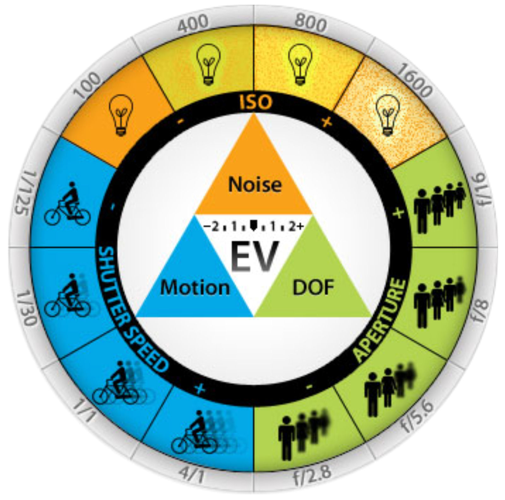

# Photography

## Exposure

Shutter Speed, Aperture, ISO
Timing, Depth of Field, Light Sensitivity

### Shutter Speed

- measured time of an image
- moment between the opening and closing of an image
- fast/high shutter speed to freeze motion (freeze the action)
- slow/low shutter speed to emphasize the motion (blur the motion)

### Aperture

- size of the hole that lets light into the camera
- specify how much a subject stays in focus
- smaller the number the larger the hole
- smaller the number, the larger the f-stop
- larger f-stop, more shallow the depth of field (less is in focus)
- smaller f-stop, more greater the depth of field (more is in focus)
- examples:
    - f/2.8 - larger aperture (smaller number, larger hole), narrow area of focus (portrait setting, person's head is in focus and the background is blurred)
    - f/20 - smaller aperture (larger number, smaller hole), greater depth of field, more of the subject and background in focus

### ISO

- light sensitivity of the film or sensor
- brighter/well lit the setting, lower the ISO (virtually no noise, highlights and shadow detail are clean)
- darker/poorly lit setting, higher the ISO (more noise in the midtone and shadow areas)

### References

- [ISO, Shutter Speed and Aperture Explained | Exposure Basics for Beginners](https://youtu.be/Edvpu_939l4?si=rTp4yPfPdkAMuLeS)
